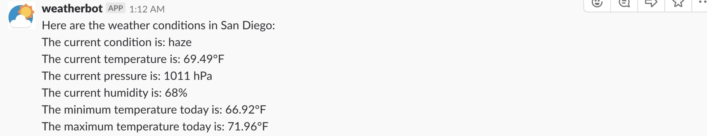

# Slack-Weather-Bot

##Author
Raymond Yeh

## About
A simple Slack Bot that reports on the current weather for a given city

## Directions
To add the bot to a channel, mention the bot by typing '@Weather Bot' in the Slack chat bar and invite the bot into the channel. 
Type '@Weather Bot' and the name of the city in the Slack chat bar to find the current weather conditions at the city entered.

For Example, if you enter in '@Weather Bot San Diego'
 
****
 
 
You will get the following
****
 

## Description/Design
This bot is developed using Node.js. In order to connect with the Slack API, I use SlackBot, a Node.js library for easy operation with the Slack API. SlackBot greatly simplifies writing API calls to Slack's Real Time Messaging API. The bot is hosted on Heroku.
 

The bot itself is rather simple. It mostly contains handlers for events coming in from Slack. In this case we are mostly concerned about message events.
 

There are couple things we need to keep track of from incoming messages.
First, we only have the bot respond to incoming messages. This is determined by the 'type' field in the incoming JSON file. If it is not a message, the bot does not respond.
 

Next, if the bot posts a message, we don't want the bot to respond to itself, otherwise it could cause an endless loop. There is a condition that checks if the message is sent from a bot. This is determined by the 'subtype' field in the incoming JSON file. If the message did not come from a bot, the bot does not respond.
 

The bot also should only respond when the user types in '@Weather Bot' in Slack to call out the bot. Otherwise the bot would respond to every message a user sends in Slack. When the user sends a message from Slack with '@Weather Bot', the bot id number is displayed in the 'message' field in the incoming JSON file. The bot can use this to determine if the user has typed in '@Weather Bot' or not. The bot id is saved into a variable when the bot is first initialized. If the text does not contain the bot id saved in the variable, the bot does not respond.
 

If all these conditions are met, the bot has received a valid message from the user. The next step is to determine the contents of the message. If the message contains help, the runHelp function is executed which posts a message for the help directions on Slack. Otherwise, the text is sent over to the handleMessage function. The handleMessage function takes in both the message text and channel of the message that was sent. We need to know the channel because we want to post the response to the same channel the original message was sent.
 

The message text from the JSON comes in formatted as the bot id + the corresponding text. Regex is used to remove the bot id number from the message. The remaining string is then used to construct a URL for an API request to openweathermap.org to get data on current condition, temperature, pressure, humidty,maximum temperature, and minimum temperature at the specified city. These values are then populated into the response text and sent as a message to the corresponding channel on Slack. If openweathermap.org returns an error, that means it could not find the city the user was looking for. A message is sent back to Slack telling the user to try again with another city.
 

One challenge was finding a way to get the bot to respond only when the user types in '@Weather Bot'. It was somewhat tricky to find out because the incoming message text does not contain the '@Weather Bot' string so I can not simply search for '@Weather Bot' in the message. I figured out that '@Weather Bot' is sent as a Slack id number attached in front of incoming message text. You can get the id number for the bot from the 'id' field in the JSON response when you first initialize the bot and check all incoming messages for this bot id number. Another challenge was setting up the app on Heroku. When using a free account, Heroku only allows the app to idle for 30 minutes, otherwise it will shut down. One way to get around this was to write a function in the bot that sends a get request to itself around every 30 minutes. I felt like this was not too reliable and decided to go with an upgraded account instead. This allows the app to run 24/7 on Heroku.

